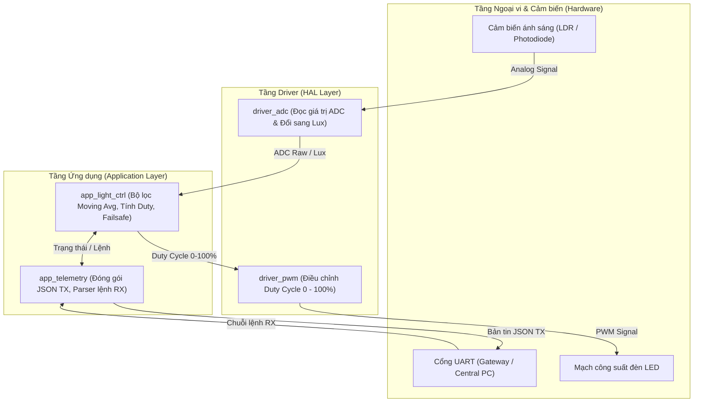
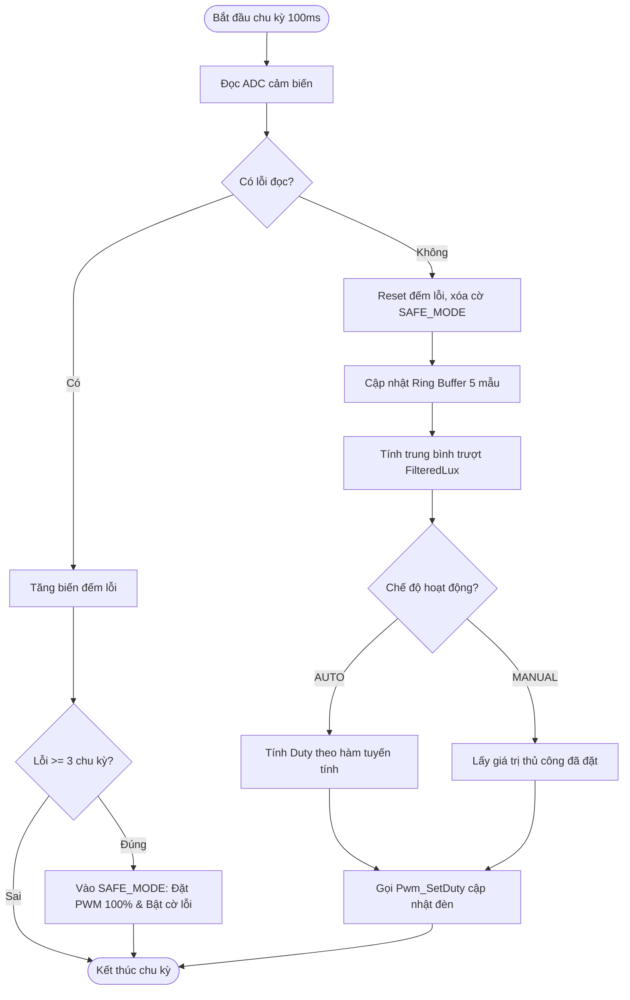

# TÀI LIỆU THIẾT KẾ KIẾN TRÚC HỆ THỐNG
## Dự án: Hệ thống Chiếu sáng Thông minh (Smart Lighting System Controller - SLSC)

---

## 1. Giới thiệu tổng quan
Dự án **SLSC (Smart Lighting System Controller)** là firmware điều khiển hệ thống đèn LED chiếu sáng thông minh (áp dụng cho đèn đường thông minh, đèn hành lang trường học hoặc khuôn viên văn phòng IoT).
Hệ thống thu thập dữ liệu độ sáng môi trường (Lux) từ cảm biến quang qua ADC, xử lý lọc nhiễu trung bình trượt 5 mẫu, điều khiển độ mờ sáng (Dimming) của đèn thông qua PWM, giao tiếp với máy tính trung tâm/Gateway qua UART và xử lý cơ chế Failsafe bảo vệ an toàn.

---

## 2. Sơ đồ kiến trúc tổng thể (System Architecture)

Hệ thống được thiết kế theo kiến trúc phân tầng chuẩn cho hệ thống nhúng (Embedded Systems):
- **Application Layer (Tầng ứng dụng)**: Quản lý logic điều khiển và truyền nhận thông tin.
- **Hardware Abstraction / Driver Layer (Tầng điều khiển phần cứng)**: Giao tiếp với ngoại vi ADC, PWM, UART.

---

## 3. Phân chia Module & Trách nhiệm

| Module | Tệp tin | Trách nhiệm chính |
| :--- | :--- | :--- |
| **Driver ADC** | `driver_adc.h`, `driver_adc.c` | Khởi tạo phần cứng ADC, đọc giá trị thô `0 - 4095`, quy đổi điện áp sang đơn vị quang thông `Lux` (`0 - 2000 Lux`). Cung cấp hàm mô phỏng lỗi phần cứng. |
| **Driver PWM** | `driver_pwm.h`, `driver_pwm.c` | Khởi tạo Timer PWM, cấu hình Duty Cycle `0 - 100%` cho tải đèn LED công suất. |
| **App Light Control** | `app_light_ctrl.h`, `app_light_ctrl.c` | Thuật toán lọc trung bình trượt 5 mẫu (`Moving Average`), thuật toán điều khiển tuyến tính độ sáng, máy trạng thái chuyển đổi giữa chế độ `AUTO` và `MANUAL`, đếm lỗi và kích hoạt `SAFE_MODE` khi cảm biến mất tín hiệu quá 3 chu kỳ (>300ms). |
| **App Telemetry** | `app_telemetry.h`, `app_telemetry.c` | Chuẩn hóa dữ liệu theo định dạng JSON gửi qua UART TX chu kỳ 1s. Bóc tách và thực thi gói lệnh cấu hình nhận từ UART RX. |
| **Main / System Loop** | `main.c` | Khởi tạo toàn bộ module, thiết lập vòng lặp sự kiện điều phối chu kỳ 100ms (lấy mẫu & điều khiển) và chu kỳ 1s (truyền thông telemetry). |

---

## 4. Luồng hoạt động chính (Operational Workflow)

### 4.1. Chu kỳ xử lý 100ms (Control Loop)
Mỗi 100ms, bộ định thời gọi hàm `LightCtrl_ProcessLoop()`:
1. Gọi `Adc_ReadRawValue()` để lấy mẫu giá trị cảm biến.
2. **Kiểm tra trạng thái lỗi (Failsafe)**:
   - Nếu đọc thất bại: tăng biến đếm `s_u8SensorErrorCount`. Nếu `count >= 3`, chuyển trạng thái sang `SAFE_MODE`, ép bật đèn 100% để đảm bảo an toàn an ninh.
   - Nếu đọc thành công: reset bộ đếm lỗi về 0, chuyển trạng thái về `NORMAL`.
3. Đẩy giá trị vào mảng đệm vòng (Ring Buffer 5 phần tử) và tính trung bình trượt (`FilteredLux`).
4. **Xử lý chế độ hoạt động**:
   - Nếu `AUTO`:
     - $Lux < 100$: Đèn bật cực đại $100\%$, bật cờ `bIsNightMode`.
     - $100 \le Lux \le 800$: Đèn điều chỉnh tăng tuyến tính từ $10\%$ đến $90\%$.
     - $Lux > 800$: Trời sáng, tắt đèn ($0\%$).
   - Nếu `MANUAL`: giữ mức sáng cố định theo lệnh của người vận hành.
5. Cập nhật Duty Cycle ra ngoại vi thông qua `Pwm_SetDuty()`.

---

## 5. Interface giữa các Module (API Contracts)

### 5.1. Giữa App Control và Driver ADC
- `AdcStatus_te Adc_ReadRawValue(uint16_t *pu16AdcVal)`
- `AdcStatus_te Adc_ConvertToLux(uint16_t u16AdcVal, float *pf32Lux)`

### 5.2. Giữa App Control và Driver PWM
- `PwmStatus_te Pwm_SetDuty(uint8_t u8DutyCycle)`
- `PwmStatus_te Pwm_GetDuty(uint8_t *pu8DutyCycle)`

### 5.3. Giữa App Telemetry và App Control
- `LightStatus_te LightCtrl_GetData(LightData_ts *pOutData)`: Lấy cấu trúc dữ liệu gồm `f32FilteredLux`, `u8DutyCycle`, `eState`, `eMode`, `bIsFault`.
- `void LightCtrl_SetMode(LightMode_te eNewMode)`: Đổi chế độ giữa `AUTO` và `MANUAL`.
- `void LightCtrl_SetManualDuty(uint8_t u8DutyCycle)`: Cài đặt công suất đèn khi ở chế độ `MANUAL`.
